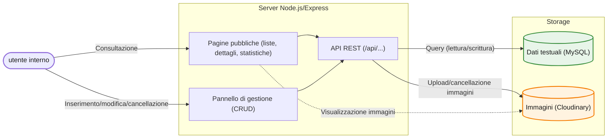

# Gestione sale operatorie e interventi chirurgici
 
Servizio web per memorizzare e consultare i dati di configurazione degli interventi chirurgici e delle sale operatorie di una clinica.
 
## Indice
 
- [Panoramica](#panoramica)
- [Stack tecnologico](#stack-tecnologico)
- [Architettura](#architettura)
- [Struttura del progetto](#struttura-del-progetto)
- [Funzionalità](#funzionalità)
- [Pagine](#pagine)
- [API principali](#api-principali)
- [Sicurezza](#sicurezza)
- [Licenza](#licenza)
## Panoramica
 
L'applicazione gestisce i dati di configurazione degli interventi chirurgici e delle sale operatorie di una clinica: anagrafica di chirurghi e specialistiche, schede dei singoli interventi con relativa documentazione fotografica (tavoli) e statistiche aggregate.
 
È pensata per un uso interno: non è esposta pubblicamente e non implementa un sistema di autenticazione, l'accesso è limitato a chi ha visibilità sull'ambiente in cui è distribuita.

Le immagini sono gestite tramite **Cloudinary**; i dati testuali sono conservati in un database **MySQL** ospitato su **Aiven**.
 
## Stack tecnologico
 
**Backend**
- Node.js + Express 5
- MySQL (driver `mysql2`, connessione via pool) — hosting su Aiven
- `multer` (in memoria) + Cloudinary SDK per l'upload delle immagini
- `dotenv` per la configurazione

**Frontend**
- HTML, CSS, JavaScript vanilla
- Costruzione dinamica del DOM lato client tramite fetch verso le API, con alcune pagine di dettaglio arricchite da un piccolo rendering server-side (titolo, intestazione)

## Architettura
 

 
## Struttura del progetto
 
```
├── database/
│   └── schema.sql                    # schema delle tabelle MySQL
├── public/
│   ├── index.html                    # home, statistiche generali
│   ├── interventi.html               # lista interventi
│   ├── intervento.html               # dettaglio intervento (immagini + scheda)
│   ├── chirurghi.html                # lista chirurghi
│   ├── chirurgo.html                 # dettaglio chirurgo (statistiche)
│   ├── specialistiche.html           # lista specialistiche
│   ├── specialistica.html            # dettaglio specialistica (statistiche)
│   ├── gestione.html                 # pannello di amministrazione (CRUD)
│   ├── 404.html
│   ├── stile/
│   │   └── stile.css
│   ├── scripts/
│   │   ├── utils.js                  # escapeHTML, condiviso client/server
│   │   ├── lista_contenuti_script.js # liste paginate con ricerca
│   │   ├── intervento_script.js
│   │   ├── chirurgo_script.js
│   │   ├── specialistica_script.js
│   │   ├── statistiche_script.js
│   │   ├── slider.js                 # slider immagini riutilizzabile
│   │   └── gestione_script.js        # logica del pannello di gestione
│   └── immagini/favicon/
├── src/
│   ├── db.js                         # pool di connessione MySQL
│   ├── cloudinaryConfig.js           # configurazione Cloudinary e multer
│   ├── middleware/
│   │   └── images.js                 # gestione errori upload (multer)
│   ├── routes/
│   │   ├── chirurghiRoutes.js
│   │   ├── specialisticheRoutes.js
│   │   ├── interventiRoutes.js
│   │   ├── statisticheRoutes.js
│   │   └── tavoliRoutes.js
│   └── utils/
│       ├── filtro.js                 # costruzione clausole WHERE per la ricerca multi-colonna
│       └── validazione.js
├── index.js                          # entry point del server Express
├── favicon.ico
└── package.json
```
 
## Funzionalità
 
- Anagrafica di chirurghi e specialistiche, con vincolo di cancellazione se referenziati da un intervento
- Creazione, consultazione, modifica e cancellazione degli interventi chirurgici
- Ricerca e filtro multi-colonna con paginazione sulle liste
- Pagine di dettaglio (intervento, chirurgo, specialistica) con rendering server-side del titolo e completamento dati lato client
- Upload, consultazione ed eliminazione delle immagini (tavoli) associate a un intervento, con storage su Cloudinary
- Statistiche globali e per singolo chirurgo/specialistica (numero di interventi, specialistiche/chirurghi più frequenti)
- Interfaccia responsive, con menu di navigazione a comparsa su mobile
 
## Pagine
 
| Percorso | Descrizione |
| --- | --- |
| `/` | Home, con le statistiche generali |
| `/interventi.html` | Lista interventi, con ricerca e paginazione |
| `/intervento.html?id=` | Dettaglio di un intervento, con galleria immagini |
| `/chirurghi.html` | Lista chirurghi |
| `/chirurgo.html?id=` | Dettaglio di un chirurgo, con statistiche |
| `/specialistiche.html` | Lista specialistiche |
| `/specialistica.html?id=` | Dettaglio di una specialistica, con statistiche |
| `/gestione.html` | Pannello di amministrazione: creazione, modifica e cancellazione di chirurghi, specialistiche, interventi e immagini |
| `/404.html` | Pagina d'errore per risorse non trovate |
 
## API principali
 
Le route seguono una convenzione singolare/plurale: percorsi al singolare (`/api/risorsa/:id`) per le operazioni su una singola risorsa, plurale (`/api/risorse`) riservato alla lista. Tutte le risposte seguono la forma `{ success: boolean, message: string, ... }`, con i dati aggiunti sotto chiavi dedicate.
 
### Interventi
 
| Metodo | Endpoint | Descrizione |
| --- | --- | --- |
| GET | `/api/interventi` | Lista interventi, con filtro multi-colonna e paginazione |
| GET | `/api/intervento/:id` | Dettaglio di un intervento, comprese le immagini associate |
| POST | `/api/intervento` | Creazione di un intervento (con eventuale upload immagini) |
| PUT | `/api/intervento/:id` | Aggiornamento di un intervento |
| DELETE | `/api/intervento/:id` | Cancellazione di un intervento (immagini rimosse a cascata) |
| GET | `/intervento.html?id=` | Pagina di dettaglio, rendering server-side |
 
### Tavoli (immagini di un intervento)
 
| Metodo | Endpoint | Descrizione |
| --- | --- | --- |
| GET | `/api/intervento/:id/tavoli` | Lista delle immagini di un intervento |
| POST | `/api/intervento/:id/tavolo` | Aggiunta di una o più immagini |
| DELETE | `/api/intervento/:id/tavolo/:idTavolo` | Rimozione di una singola immagine |
 
### Chirurghi
 
| Metodo | Endpoint | Descrizione |
| --- | --- | --- |
| GET | `/api/chirurghi` | Lista chirurghi, con filtro e paginazione (`tutti=true` per l'elenco completo) |
| GET | `/api/chirurgo/:id` | Dettaglio di un chirurgo |
| POST | `/api/chirurgo` | Creazione di un chirurgo |
| PUT | `/api/chirurgo/:id` | Aggiornamento di un chirurgo |
| DELETE | `/api/chirurgo/:id` | Cancellazione (bloccata se il chirurgo è associato a interventi) |
| GET | `/api/chirurgo/:id/statistiche` | Numero di interventi e specialistiche più frequenti per il chirurgo |
| GET | `/chirurgo.html?id=` | Pagina di dettaglio, rendering server-side |
 
### Specialistiche
 
| Metodo | Endpoint | Descrizione |
| --- | --- | --- |
| GET | `/api/specialistiche` | Lista specialistiche, con filtro e paginazione (`tutti=true` per l'elenco completo) |
| GET | `/api/specialistica/:id` | Dettaglio di una specialistica |
| POST | `/api/specialistica` | Creazione di una specialistica |
| PUT | `/api/specialistica/:id` | Aggiornamento di una specialistica |
| DELETE | `/api/specialistica/:id` | Cancellazione (bloccata se associata a interventi) |
| GET | `/api/specialistica/:id/statistiche` | Numero di interventi e chirurghi più frequenti per la specialistica |
| GET | `/specialistica.html?id=` | Pagina di dettaglio, rendering server-side |
 
### Statistiche globali
 
| Metodo | Endpoint | Descrizione |
| --- | --- | --- |
| GET | `/api/statistiche` | Conteggi totali e specialistica/chirurgo con più interventi |
 
## Sicurezza
 
Il progetto adotta alcune misure di base, coerenti con la sua natura di strumento interno:
 
- **Query parametrizzate** ovunque: nessuna concatenazione di stringhe SQL;
- **Validazione upload immagini**: whitelist di tipi MIME (jpeg, png, webp), limite di dimensione (5MB) e di numero di file per richiesta;
- **Vincoli referenziali a livello di database**: `ON DELETE RESTRICT` per chirurghi/specialistiche referenziati da un intervento, `ON DELETE CASCADE` per le immagini di un intervento eliminato;
- **Escaping HTML lato client** (`escapeHTML`) sui dati inseriti dinamicamente nelle pagine pubbliche di dettaglio, prima dell'inserimento via `innerHTML`.
L'applicazione **non** implementa un sistema di autenticazione: è pensata per un uso interno, su un ambiente non esposto pubblicamente, non per la pubblicazione come servizio accessibile da chiunque.
 
## Licenza
 
Progetto pubblicato esclusivamente a scopo dimostrativo/portfolio. Tutti i diritti riservati — vedi [LICENSE](./LICENSE).
 
**Autore:** Francesco Moretti ([@FrancescoMoretti](https://github.com/FrancescoMoretti))